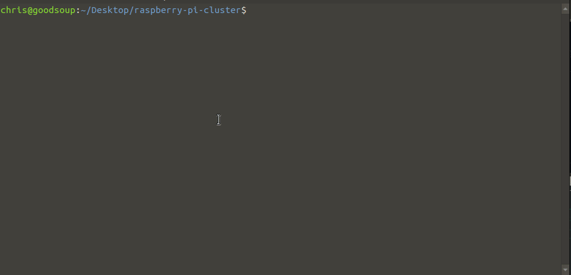
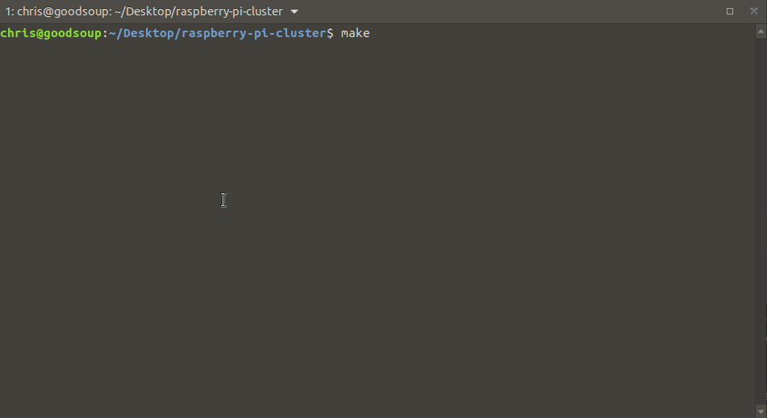

<p>
  <br>
  <h1 align="center">
    <a href="https://github.com/christopherwoodall/raspberry-pi-cluster">
      RPi Cluster
    </a>
  </h1>
  <h3 align="center">
    Under Construction
  </h3>
</p>

<h4 align="center">Tools for Deploying a Raspberry Pi Cluster.</h4>

<p align="center">
  <a href="#about">About</a> •
  <a href="#installation">Installation</a> •
  <a href="#features">Features</a> •
  <a href="#demo">Demo</a> •
</p>

---

## About

This project contains a series of Ansible Playbooks, as well as BASH, Python, and other relevant tools to kick off the deployment of a Raspberry Pi cluster.


## Installation

There are two ways to get started. The first is by running `make` in the root directory of this project, or you can:
```
cd ansible
chmod +x run.yml
./run0.yml
```


## Features


## Demo
### Deployment


### Tools

